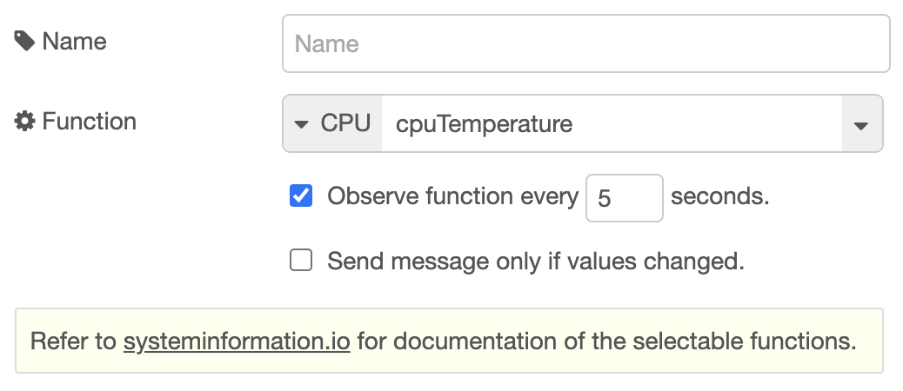

# @ralphwetzel/node-red-systeminformation


Node-RED interface to [systeminformation](https://systeminformation.io/), the System Information Library for Node.JS

Citing @sebhildebrandt, the creator of [systeminformation](https://github.com/sebhildebrandt/systeminformation#the-systeminformation-project):
> Started as a small project [...], it now has > 15,000 lines of code, > 600 versions published, up to 8 mio downloads per month, > 220 mio downloads overall. **#1 NPM ranking for backend packages**. 

This node lets you call one of the functions provided by `systeminformation`. The result of each call will be returned as `msg.payload`.

There are two ways to select the function to be called:

### Static configuration via the node property editor
You may configure the to-be-called function via the nodes property editor.



Functions are arranged in groups, following the `systeminformation` documentation.

In case a function expects additional parameters, those may be defined as required.

Additionally, the node may be configured to observe the selected function by polling at a given rate. If polling is enabled, you may decide to let the node emit a `msg` only if the function call returned changed values.

### Dynamic mode
You may trigger the call of a `systeminformation` function as well by sending to the node a `msg` that is configured accordingly:

`topic`: name of the `systeminformation` function to be called.

`payload`: optional `<object>` with parameters to be passed to the function. The keys of the objects properties have to match the names of the parameters as defined by the `systeminformation` documentation, e.g:

```
{
    topic: 'versions',
    payload: {
        apps: 'npm, php, postgresql'
    }
}
```

> The dynamic mode may be used in addition & parallel to a static configuration, as shown in the provided example.
